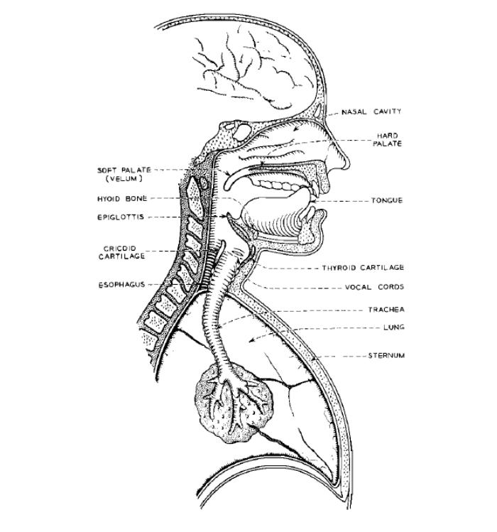
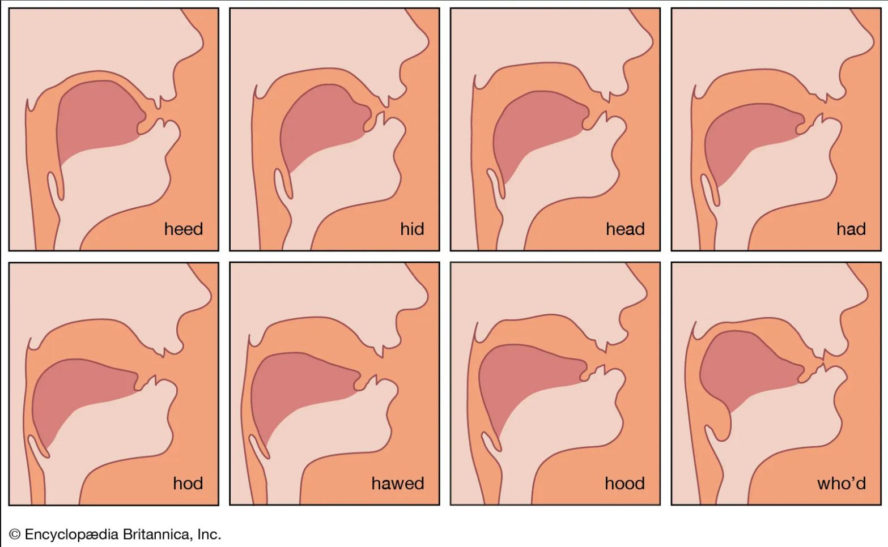
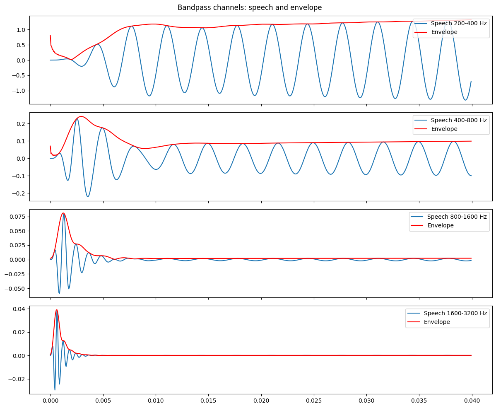
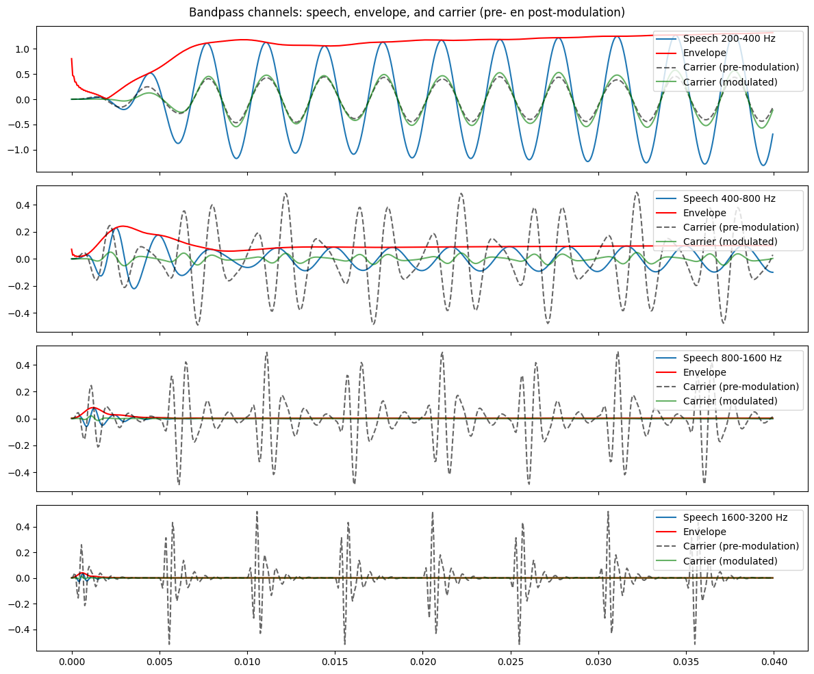

I recently rewatched this [cover](https://www.youtube.com/watch?v=m7_1HUEvieE) of *Hide and Seek* by the English musician Jacob Collier originally by [Imogen Heap](https://www.youtube.com/watch?v=UYIAfiVGluk), parts of which were used in [this song](https://www.youtube.com/watch?v=pBI3lc18k8Q) by Jason Derulo. While the musician in me was amazed at the musicality and genius of Collier's version, the engineer in me wondered how this technology worked: how did that keyboard "sing" like a human? The answer: using something called a vocoder.

I had heard of vocoders before, but in terms of speech processing - not musical synthesis. This post is an attempt to answer a few key questions:

1. How do speech vocoders work under the hood?
2. How do speech vocoders relate to the vocoders used in the examples above?
3. Can I code my own vocoder using basic signal processing principles? 

First, let's look at how the human voice produces speech.

# How do speech and singing work?

Producing speech depends on two systems working together: the **source** (lungs and vocal folds) that generates sound, and the **filter** (oral and nasal cavities, tongue, lips, and palate) that shapes it.

Sound is produced when air from the lungs (the main source of energy) passes through the vocal folds in the larynx. The folds vibrate, opening and closing rapidly due to pressure differences across the glottis (the space between them). Each cycle injects energy into the system, producing a **buzzing tone**. This tone consists of a fundamental frequency ($F_x$, perceived as pitch) and a series of harmonics at integer multiples of $F_x$​. Tightening or loosening the vocal folds changes their vibration rate, which shifts the pitch.

The vocal tract (tongue, lips, palate, etc.) then acts as a **resonant filter**. Just like an acoustic cavity, it amplifies some frequencies and attenuates others. These resonances appear as formants, visible as spectral peaks. Crucially, formants remain relatively stable even when the pitch changes, which is why vowels keep their identity whether spoken high or low.

If you say “yee-haw” in both a low and high voice, notice how your mouth shape (the filter) stays the same, even though the pitch (the source) changes.

# How does a Talkbox work?
If you are familiar with music containing vocoders, you may have come across music using something similar: a talkbox. This technology was famously used by [Stevie Wonder](https://www.youtube.com/watch?v=VX5v-S_jGD4) and [Roger Troutman](https://www.youtube.com/watch?v=ZwXlTqjyf54). Here is a more recent [example](https://www.youtube.com/watch?v=RHu0ALxqUIo) of a talkbox used in a cover of *Harder, Better, Faster, Stronger* by the band Scary Pockets. 

A talkbox is almost a physical demonstration of the source-filter model that humans use to speak. Instead of vocal folds/cords that produce a buzz, the **source** is usually an electric guitar, keyboard, or synthesizer. That signal is sent through a small speaker driver mounted in the talkbox. This is often often a compression driver or horn driver --- a common PA speaker part which handles the mid to high frequencies. The driver pushes the sound through a plastic tube, which is placed inside the musician's mouth.

The performer then does not vocalise (i.e., their vocal cords do not create an additional **source**), but they do articulate as if they are speaking or singing. This produces the same formants as when they use their natural voice --- only now using the fundamental frequency from the keyboard, guitar, or synthesizer. In essence, they are shaping the sound from the other instrument as if it were their own voice. This sound is then picked up with a microphone.

You might articulate the word "cool" with the plastic tube in your mouth without vocalising. If you simultaneously play a chord on the keyboard feeding into the talkbox, you would "speak" a chord that says "cool". Neat! 

Although similar, talkboxes are not the same thing as vocoders. They are more like analog cousins to vocoders. In the next section, we'll explore the nuts and bolts of vocoders with a few coding examples.

## Hear the difference
Here is another [video](https://www.youtube.com/watch?v=-jKB9rT3uxE) by Scary Pockets where they use both a vocoder and a talkbox. Although both have the same goal in this instance (making an instrument sound like speech), the vocoder sounds a bit more digital, which it is! If you listen closely, you can also hear breaths and mouth sounds between some notes from the talkbox, which isn't as audible in the vocoder sound.

# How does a vocoder work?
## Early vocoders
The first vocoder was invented in the 1930's by Homer Dudley at Bell labs as a tool for analysing and synthesising speech. The original purpose was to compress the bandwidth of speech for transmission over early phone lines and for military purposes. 

The process of vocoding works as follows:
1. **Split incoming voice into frequency bands**
	The incoming voice is split into predefined frequency bands, for instance 200-400 Hz, 400-800 Hz, etc. Older vocoders split it into 8 or 10 frequency bands, while newer approaches use up to 40.
2. **Determine the filter envelope**
	Next, we determine how the energy in each frequency band changes over time. This information is called the envelope of that signal and will be used to filter or shape the sound. In essence, this is a heavily discretised representation of what is happening acoustically in your mouth when you shape your own voice to speak. We extract the envelope by applying a rectifier (i.e., the absolute value of the waveform ),  

    $$r[n] = |{x[n]}|$$

    and applying a low-pass filter (to smooth out rapid fluctuations in the signal), such as the Windowed-sinc low-pass filter:  

    $$h[k] = \frac{\text{sin}\left(2\pi f_c(k-\frac{M}{2})/f_s\right)}{\pi(k-\frac{M}{2})}\cdot w[k]$$

    where $f_c$ is the cutoff frequency and $w[k]$ is a window function (e.g., the [Hamming function](https://en.wikipedia.org/wiki/Window_function#Examples_of_window_functions)). Put together, the envelope detection (FIR filter) is defined as follows:  

    $$e[n]=\sum_{k=0}^{M-1}h[k]\cdot|x[n-k]|$$  

	Here is an example of what this step does to an incoming speech signal:

	
3. **Produce a carrier signal**
	The carrier signal is a basic signal that can be shaped by the source envelope to produce a new signal. In the original vocoder, this signal (also refferd to as the excitation source) was comprised of:
	- A buzz for voiced speech (e.g., /a, e, i, o, u, b, d, g/):  

    $$b[n]=\sum_{m}\delta[n-mN]$$	 

    where $N=\frac{f_s}{F_x}$ is the pitch period in samples. This produces a buzz at the detected fundamental frequency of the incoming voice signal.
	- A hiss (white noise) for unvoiced speech (e.g., /s, f, sh, p, t, k/). Dudley's hardware didn't have digital Gaussian noise (this was pre-digital). Instead, they used electronic noise generators (thermal noise from resistors, gas tubes, or static-like hiss from circuits). However, we can represent this mathematically as:  

	$$w[n]\sim \mathcal{N}(0,\sigma^2)$$  

	In a musical vocoder, the carrier signal could be a signal from any instrument, as in the case of the talkbox. 
4. **Recombine frequency bands**
	All bands are recombined (i.e., summed together), which results in a carrier signal with the spectral shape of the incoming voice signal.

	

# Coding a vocoder

Using the theory explained above, I coded a very simple vocoder in python, which you can play around with [here](https://github.com/Reubix29/vocoder-experiments).

## Vocoding speech

First, let's say we have an audio source like the following:

<audio controls>
  <source src="{{ '../audio/vocoders_pt_1/the_distant_future_source.mp3' | relative_url }}" type="audio/mp3">
  <source src="{{ '../audio/vocoders_pt_1/the_distant_future_source.ogg' | relative_url }}" type="audio/ogg">
  Your browser does not support the audio element.
</audio>

If we create a carrier out of a buzz at the fundamental frequency $F_x$ for voiced segments and a hiss (white noise) for unvoiced segments, it sounds like this:

<audio controls>
  <source src="{{ '../audio/vocoders_pt_1/the_distant_future_carrier.mp3' | relative_url }}" type="audio/mp3">
  <source src="{{ '../audio/vocoders_pt_1/the_distant_future_carrier.ogg' | relative_url }}" type="audio/ogg">
  Your browser does not support the audio element.
</audio>

When we vocode the two audio files using 8 **linearly spaced** frequency bands, we get this:

<audio controls>
  <source src="{{ '../audio/vocoders_pt_1/the_distant_future_8_band_linear.mp3' | relative_url }}" type="audio/mp3">
  <source src="{{ '../audio/vocoders_pt_1/the_distant_future_8_band_linear.ogg' | relative_url }}" type="audio/ogg">
  Your browser does not support the audio element.
</audio>

That doesn't sound so great, but if we change the band spacing to a log scale, which is closer to the way our ear perceives it, we get the following:

<audio controls>
  <source src="{{ '../audio/vocoders_pt_1/the_distant_future_8_band_log.mp3' | relative_url }}" type="audio/mp3">
  <source src="{{ '../audio/vocoders_pt_1/the_distant_future_8_band_log.ogg' | relative_url }}" type="audio/ogg">
  Your browser does not support the audio element.
</audio>

To further improve the quality, we can increase the number of bands at which we vocode. Here is an example using 40 log-spaced frequency bands:

<audio controls>
  <source src="{{ '../audio/vocoders_pt_1/the_distant_future_40_band_log.mp3' | relative_url }}" type="audio/mp3">
  <source src="{{ '../audio/vocoders_pt_1/the_distant_future_40_band_log.ogg' | relative_url }}" type="audio/ogg">
  Your browser does not support the audio element.
</audio> 

That sounds more similar to the original audio, albeit quite robotic.

## Vocoding speech into music

Next, I wanted to vocode speech with a chord as a carrier instead of a buzz/hiss mixture. Let's take this source vocal:

<audio controls>
  <source src="{{ '../audio/vocoders_pt_1/what_did_you_say_source.mp3' | relative_url }}" type="audio/mp3">
  <source src="{{ '../audio/vocoders_pt_1/what_did_you_say_source.ogg' | relative_url }}" type="audio/ogg">
  Your browser does not support the audio element.
</audio> 

We can use this carrier, which are a few chords generated in python:

<audio controls>
  <source src="{{ '../audio/vocoders_pt_1/what_did_you_say_synth.mp3' | relative_url }}" type="audio/mp3">
  <source src="{{ '../audio/vocoders_pt_1/what_did_you_say_synth.ogg' | relative_url }}" type="audio/ogg">
  Your browser does not support the audio element.
</audio> 

If we vocode this using 20 log-spaced frequency bands, silencing the portions with unvoiced speech and no speech, we get the following:

<audio controls>
  <source src="{{ '../audio/vocoders_pt_1/what_did_you_say_20_band.mp3' | relative_url }}" type="audio/mp3">
  <source src="{{ '../audio/vocoders_pt_1/what_did_you_say_20_band.ogg' | relative_url }}" type="audio/ogg">  
  Your browser does not support the audio element.
</audio> 

We can then combine this with the original vocal, resulting in the following:

<audio controls>
  <source src="{{ '../audio/vocoders_pt_1/what_did_you_say_combined.mp3' | relative_url }}" type="audio/mp3">
  <source src="{{ '../audio/vocoders_pt_1/what_did_you_say_combined.ogg' | relative_url }}" type="audio/ogg">
  Your browser does not support the audio element.
</audio> 

---
# References:
- Smith, J.O. _Spectral Audio Signal Processing,_, [online book](http://ccrma.stanford.edu/~jos/sasp/), 2011 edition.
- Kamper, H., [Speech 101](https://www.kamperh.com/notes/speech101.pdf), online course.
- Moore, R., *What Everyone Working on Spoken Language Processing Needs to Know about Spoken Language*, [Part 1](https://youtu.be/01ml3rpPZYg), [Part 2](https://www.youtube.com/watch?v=NHCSmi5VXhs).
- [A FAQ about Talkboxes by Mootbooxle](https://mootbooxle.tumblr.com/post/106170382328/the-talkbox-faq)
- [A Guide on building your own talkbox](https://www.instructables.com/DIY-Talkbox/)