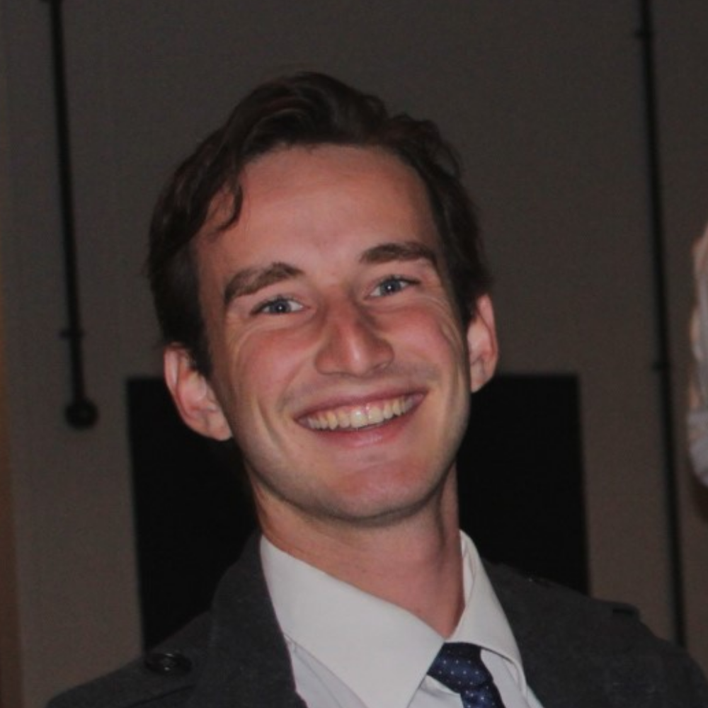

Welcome! 

I am a PhD candidate at [Stellenbosch University](http://www.sun.ac.za/), South Africa, under the supervision of [Herman Kamper](https://www.kamperh.com). My research is in the area of machine learning with a focus on speech processing. More specifically, I am interested in developing automatic reading assessment tools that can be used by teachers in underserved communities. This is challenging, because these communities usually teach in languages that do not have enough data to train large AI models. However, with a bit of creative problem-solving, we can create tools that can aid teachers and students in literacy acquisition in languages with sparse resources.

  

    <a href="m&#x61;&#105;l&#x74;&#111;:{{ site.email }}" title="email"><i class="fas fa-envelope"></i></a>
    <a href="https://github.com/{{ site.github_username }}" title="GitHub" rel="external nofollow noopener" target="_blank"><i class="fab fa-github"></i></a>
    <a href="https://www.linkedin.com/in/reubensmit" title="LinkedIn" rel="external nofollow noopener" target="_blank"><i class="fab fa-linkedin"></i></a>
    <a href="{{ site.google_scholar }}" title="Google Scholar" rel="external nofollow noopener" target="_blank"><i class="fas fa-fw fa-graduation-cap"></i></a>
  

